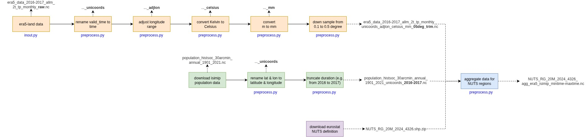

# Data Lake Backend

## Data flowchart
Downloaded data files will go through preprocessing steps as follows:

## Data Lake architecture

The data lake is separated into bronze (raw data), silver (preprocessed data), and gold (processed data). The data preprocessing package deals with levels bronze and silver. The data is stored in `.data_onehealth_db/bronze` and `.data_onehealth_db/silver`.